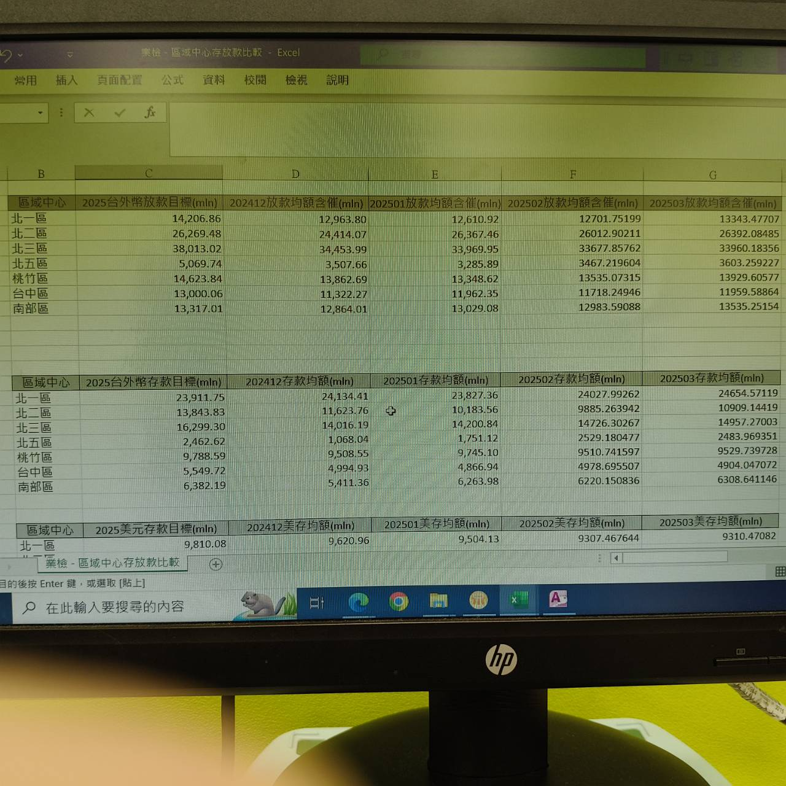

# 操作步驟
- Step1: 創建 **當月子查詢**
    - 複製舊的格式來改即可
- Step2: 設置關聯條件，連接欄位為 **區域中心代碼** 和 **AreaCd**。
- Step3: 設計要顯示的欄位。
    - **要注意欄位來自哪一個資料表。**
    - 按照舊有的格式創建欄位即可
- Ste4: 匯出 **業檢 - 區域中心存放款比較** 為 excel 檔案
    - 由於匯出的 excel 檔案的欄位出現亂序，所以需要在該 excel 檔案中重新排序。
    - 
- Step5: 將表格中的資料清空，並將對應的數據貼到對應的表格中
    - ⚠️ 注意 !!! **YYYY美元存管目標(USD) mln** 的表格(即原幣表格)中的數據不可以清空，因為它是公式。
        - 將後面的表格數據清空，並將對應的數據貼上，此時 **YYYY美元存管目標(USD) mln** 的表格中的數據會連動更新
        - 找到 Access 中 **0 - 查詢ExchangeRate** 查詢，點擊 **執行** 獲取 **當前月底** 美金價格

# 備註
- 要去根據 **每日存放款量.excel** 對應的數值檢查 excel 表格中的數據是否正確
    - **放款** 是由 **北一～六區**、**桃竹區**、**台中區**、**南部區** 做的，所以在 **每日存放款量.excel** 的 **總放款工作表** 的 **當月均額(mln)** 欄位為加總後的數值。
    - **存款** 是由 **北一～六區**、**桃竹區**、**台中區**、**南部區**、**信託部** 做的，但是在 **區域中心存放款比較** 工作表中的 **YYYYMM存款均額(mln)** 是由 **北一～六區**、**桃竹區**、**台中區**、**南部區** 加總的，所以要查出 **信託部** 的存款均額與之相加，再去比對  **每日存放款量.excel** 的 **總存款工作表** 的 **當月均額(mln)** 欄位為加總後的數值。

# 疑惑
### 為什麼「台外幣活存均額」、「台幣均額」、「存款均額」數字對不起來？
- 因為少了「信託部」的數值
- 900 大裡面獲取的「信託部」數值不準確，原因是它並不是獲取所有的客戶，而是 **900** 個客戶的數值而已
- 綜上所述如有誤差都是可以接受的範圍